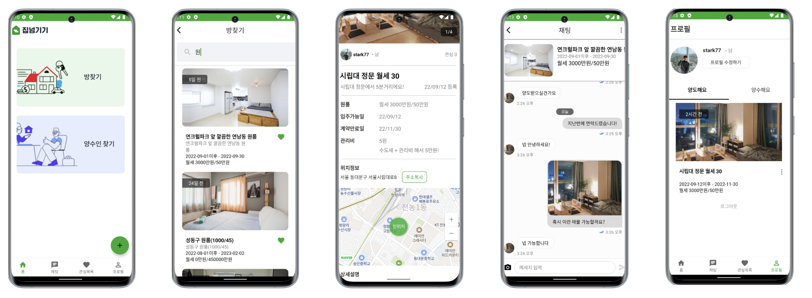

# 집넘기기 - 집 양도/양수를 중개하는 앱

Created: July 25, 2022 → August 26, 2022 
Tags: Android, Jetpack, Kotlin 
url: https://github.com/jminie-o8o/Home-Rent-App/tree/android_develop 

### 집 양도 플랫폼 안드로이드 앱 개발

- 안드로이드 2, 백엔드 2, 디자이너 1
    
    

    
- 내가 맡은 일
    - 집 양도 관련 기능
        - 방 사진 업로드 기능
    - 게시글 작성자의 실시간 채팅 기능
    - 카카오톡/네이버 소셜 로그인 기능
    - 프로필 수정 기능
    - 북마크 기능
- 시연영상
    
    [youtube link](https://www.youtube.com/watch?v=EhMm6OVVgiE)
    

---

### 사용기술

- Language: Kotlin
- OS: Android
- Library: retrofit2, android custom UI, OkHttp3, Naver/kakao Login API, DataStore, Flow, Coroutine, Daum 주소검색 Api, Stream SDK, NaverMap Api

---

- 상세 내용
    1. 양도글 페이지 구현
        - 양도글 관련 전체 페이지 구현
        - Multipart를 이용한 서버에 이미지 업로드 구현
            - 게시글을 작성, 수정 시 bitmap 이미지를 서버로 전송하는 기능 개발
        - 앨범 접근 Permission을 받고 앨범에서 사진 가져오기 구현
            - 방 사진 업로드 기능 개발
        - EditText, ImageView를 상속받아 CustomView 구현
            - 디자인 요구 사항에 맞게 커스텀 EditText 개발
        - startDragandDrop와 DropHelper를 이용한 사진 Drag and Drop 구현
            - 업로드한 방 사진의 순서를 드래그 앤 드롭을 이용하여 변경하는 기능 개발
        - Scroll 감지를 이용한 무한 스크롤 구현
            - 스크롤 위치를 감지하여 페이징 직접 구현
        - viewPager2를 이용한 이미지 목록 구현
            - 게시글의 방 사진을 스크롤해서 확인 할 수 있는 기능 개발
        
    2. 글 작성자와의 실시간 채팅 기능 구현
        - Stream sdk를 이용한 채팅 기능 구현
            - 양도자와 양수자가 글을 보고 서로 채팅을 할 수 있는 기능 개발
        - Stream SDK 채팅 UI 커스텀
    
    1. 방의 위치를 게시글에 보여주는 기능
        - naver 지도 api와 다음 주소 api를 이용한 주소 검색과 좌표에 커스텀 마커 표시 구현
            - 주소를 검색하면 해당 위치에 마커를 띄우는 기능 개발
            - 게시글 상세를 접근했을 때 해당 집 위치에 마커를 띄우는 기능 개발
        
    2. 카카오톡/네이버 소셜 로그인 (자동 로그인) 기능
        - Authenticator와 Interceptor를 이용한 JWT 갱신 요청 구현
            - access token이 만료되었을 때 자동으로 토큰 갱신 요청과 함께 이전에 보낸 요청을 다시 보내는 기능 개발
    
    1. 게시글 검색 기능
        - stateflow와 2 way data 바인딩을 이용한 실시간 데이터 변경 구현
            - 양방향 데이터 바인딩을 이용한 텍스트 입력 개발
            - Flow dedounce를 이용한 실시간 검색 구현
                - 단어를 입력하면 자동으로 검색되는 기능 개발

---

- 프로젝트를 진행하며 해결한 문제들
    1. JWT 토큰 만료시 Refresh 요청 후 이전 요청 다시 보내기
        - 토큰이 만료되면 Refresh 요청을 하고, 이전에 했던 요청을 다시 보내야하는 문제 발생
        - Authenticator를 통해서 해결 할 수 있다는 것을 발견
        - runBlocking을 통해 스레드를 잠시 막고, refresh 요청에 응답이 오면 동기적으로 이전 요청이 다시 갈 수 있도록 구현
        
    2. Splash 화면에서 멈추는 현상 수정
        - viewTreeObserver를 이용해서 onPreDraw에서 로그인 체크를 하는 로직에서 문제 발생
        - 앱이 완전 종료되지 않고 백그라운드에서 포그라운드로 돌아오면 onPreDraw가 호출되지 않아 화면을 이동하지 않는 원인을 발견
        - onPreDraw → onGlobalLayout로 리스너의 콜백 함수를 변경하여 뷰가 그려진 후 로그인 체크를 하도록 수정하여 문제 해결