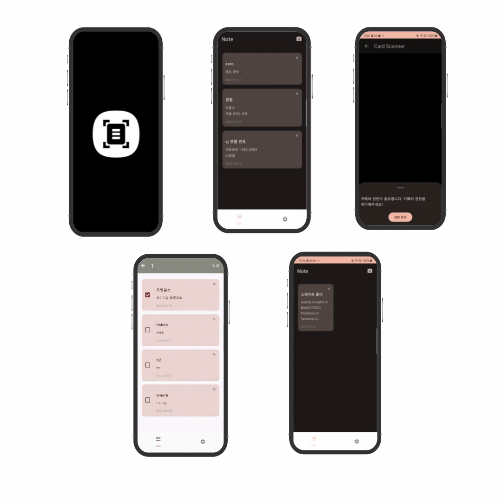

# Manual Memo - 사진을 찍어 메모를 생성하는 앱

Created: July 23, 2022 → August 26, 2022
Tags: Android, Compose, Kotlin
url: https://github.com/ese111/ScannerMemo

### 사진에서 텍스트를 추출해서 메모하는 메모장 앱 (기여도 100%)

- ML kit을 이용한 사진에서 텍스트를 추출
- DataStore를 이용한 데이터 저장, 수정, 삭제
- Compose를 이용한 뷰 구성
- State를 이용한 상태 관리

---

### 사용기술

- Language: Kotlin
- OS: Android
- Library: Compose, DataStore, Coroutine, Flow, Accompanist, ML kit, CameraX, Navigation Component, Hilt

---

## 프로젝트 설명

약품 설명서나, 전단지 같이 가지고 있기에는 부담스럽지만 꼭 찾으면 없는 텍스트를 손으로 적어놓는게 아니라 사진 한장 찍으면 자동으로 메모로 만들어 저장해주는 앱입니다.

## 주요 기능

- `Compose`를 이용한 전체 뷰 구현

- `StateFlow`와 `State`를 이용한 상태 관리
    - `StateHolder`를 이용한 `state hoisting`으로 상태관리 구현

- Accompanist의 Permission을 이용해서 카메라 권한 획득 구현

- DataStore를 이용한 삽입/수정/삭제 기능 구현

- Navigation을 이용한 화면 이동 구현

- CameraX + ML kit을 이용한 사진에서 텍스트 추출 기능구현

---

- 상세 설명
    1. 사진이나 바코드를 스캔하여 데이터를 저장하는 기능
        - 사진에서 텍스트 불러오기
            - `ImageCapture.OnImageSavedCallback` 을 이용해서 촬영한 사진이 저장되면 사진을  ML kit의 `TextRecognition` 으로 분석
            - 추출된 String을 가져와서 제목을 입력 받음
            - 제목과 저장 날짜, 내용을 `kotlinx.serialization`으로 ********직렬화해서 DataStore에 저장
        - QR 스캔
            - `ImageAnalysis.Analyzer` 를 통해서 실시간으로 `ImageProxy` 객체를 받아옴
            - `BarcodeScanning` 를 이용해서 `ImageProxy`의 image를 분석
            - 만약 QR이 인식되고 인식된 QR의 데이터가 WIFI나 URL이면 해당 String을 `Dialog`에 띄워줌
        
    2. 추출한 텍스트 읽기, 쓰기, 수정, 삭제 기능
        - 읽기
            - DataStore는 기본적으로 Flow를 이용해서 데이터를 방출
            - Flow로 받은 `Preferences` List를 Map<id: Int, content: Note>로 변경
            - Map을 stateIn을 사용해서 StateFlow로 변경해서 storage에 보관
            - datasource에서 map을 이용해서 value만 List로 변경 후 ViewModel에서 받음
            - Flow<List>를 view에서 `collectAsStateWithLifecycle` 를 통해 State로 변경
            - `Composable`에서 상태를 감지
        - 쓰기
            - 작성된 메모를 `kotlinx.serialization` 로 직렬화해서 DataStore에 저장
                - 현재있는 데이터의 마지막 id 값 +1를 해서 id 값 설정
                - dataTime 라이브러리를 사용해서 저장된 시간 저장
        - 수정
            - 수정된 메모의 제목과 내용을 copy로 변경 후 viewModel에 전달
            - viewModel → repository → storage까지 데이터 전달
            - storage에서 `StateFlow<Map>`으로 보관 중인 데이터를 변경 후 `DataStore`에 저장
        - 삭제
            - id를 이용해서 Map에서 데이터를 삭제 후 저장
    

---

- 고민한 부분
    - `DataStore`의 사용 이유
        - 메모의 특성상 문자열과 날짜 등 가벼운 데이터만 저장하면 된다고 판단했습니다.
        - 굳이 무거운 `Room`이나 `Realm`까지는 사용하지 않아도 될거 같았습니다.
        - 직렬화를 해서 문자열로 저장하면 디비를 열고 닫는 비용을 아낄 수 있을거 같아서 사용했습니다.
        - `flow` 를 지원하는 `DataStore`를 사용하면 변경 사항을 반영하기 편리할 거 같아서 사용했습니다.
    - 직렬화의 이유
        - 문자열만 저장하면 되는 상황이기 때문에 직렬화해서 문자열로 한번에 저장하면 `Proto Datastore` 나 Room보다 비용이 절약될 거 같아서 직렬화 후 저장하도록 하였습니다.
    - Map을 사용한 이유
        - id를 key 값으로 Map으로 저장하면 삭제, 편집시에 List를 순회하는 거 보다 빠르게 수정, 삭제가 가능해서 Map을 사용하였습니다.