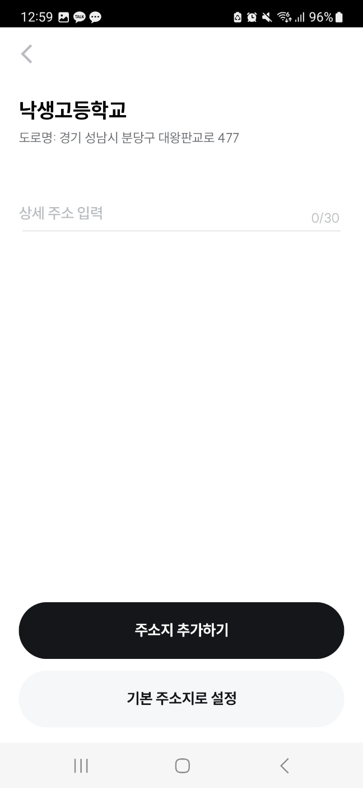

# ALLEY 운영 및 유지보수

Created: December 5, 2022 → January 13, 2023
Tags: Android, Coroutine, Flow, Jetpack, MVI, REST API, XML
URL: https://play.google.com/store/apps/details?id=com.co.swing.day_rider

<aside>
💡 배달용 PM을 대여하는 앨리 특성상 저가형 서브폰을 사용하는 유저가 많아서 다양한 기기와 버전에 대응하는 경험을 하고, 입사 후 인수인계를 받고 바로 투입되어 여러 버그들을 직접 수정하고 배포해 볼 수 있는 기회를 갖을 수 있었습니다.

</aside>

### 앱 설명

- 지도에서 킥보드, 오토바이 등을 QR 스캔 후 탑승하는 기능 제공
- 리스나 구독 상품 판매
- 리스, 구독 기기 배송 수거 신청 기능 제공

### 사용기술

- Language: `Kotlin`
- OS: `Android`
- Library: `Jetpack`, `SharedPreferences`, `MVVM`, `MVI`, `Hilt`, `retrofit2`, `Okhttp3`, `glide`, `Gson`, `databinding`

---

### 주요업무

- ALLEY 안드로이드 앱 설계 및 개발, 유지보수
- 안드로이드 파트는 혼자 운영 및 유지보수, 배포

---

### 기존 프로젝트 문제점 분석 및 개선

1. 배포 자동화 구축
    
    기존 프로젝트에서는 배포시 직접 배포를 진행하고 있었습니다.
    
    - 테스트 앱이나 릴리즈 앱 배포시 AAB를 `firebase`나 `Google play console`에 직접 업로드
    - version code를 버전마다 수정하고 AAB 빌드
    
    이를 해결하기 위해 배포 자동화 환경을 구축하였습니다.
    
    - `fastlane` 적용해서 터미널에 명령어를 입력하면 테스트앱 혹은 릴리즈 앱이 자동으로 배포 될 수 있도록 환경을 구축
    
2. 주소지 개편 (UX 개선)
    
    기존 프로젝트에서는 하기와 같은 문제가 있었습니다
    
    - 기본 주소지가 없어서 구독/리스 주문시 마다 주소지를 입력
    - 리스/구독 같은 경우 매달 혹은 매주 이용하는 유저들이 있었던 만큼 매번 주소지를 입력하기 번거롭다는 요구사항 발생
    
    이를 해결하기 위해 다음과 같은 기능을 추가 구현하였습니다
    
    - 기본 주소지, 추가 주소지 추가, 수정, 삭제 기능 구현

        

            
            
            
        
   
        
    - 다음 주소 API를 이용해 선택한 주소지의 정보를 서버로 보내서 저장
    - 추가 주소지 입력 및 수정 삭제 기능 구현
        - `XML` 이용한 UI layout 구현
        - `RecyclerView`를 이용한 동적인 뷰 구현
        - `retrofit2`, `okhttp3`를 이용한 네트워크 통신 구현
    
3. 지도에 들어갔다가 나오면 앱을 다시 켤 수 없는 버그 수정
    
    기존 프로젝트에서는 네트워크 통신에 관련해서 하기와 같은 문제점이 있었습니다.
    
    - 타보기 기능 이용 후 앱을 다시 켜보면 `NullPointErexception`과 함께 앱 종료
    - CS 사항 인입 시 데이터 삭제 후 다시 실행시켜 달라는 안내로 대응
    
    이 문제를 해결하기 위해, 다음과 같이 원인을 분석하고 수정하였습니다.
    
    - 서버 로그, `firebase Crashlytics` 확인
        - 앱이 시작과 동시에 어떠한 서버 통신도 하지 않고 종료되는 것을 확인
    - Application class에서 디버깅
        - `SharedPreferences`에 직렬화되어 저장된 Location 객체를 역직렬화 중 종료되는 것을 확인
    - `3-party-Library`가 `SharedPreferences`에서 역직렬화해서 꺼내올때 직렬화 라이브러리가 설정되지 않아 `NullPointErexception`이 나오는 것을 확인하고, 직렬화 라이브러리를 `Gson`으로 설정 후 버그 수정