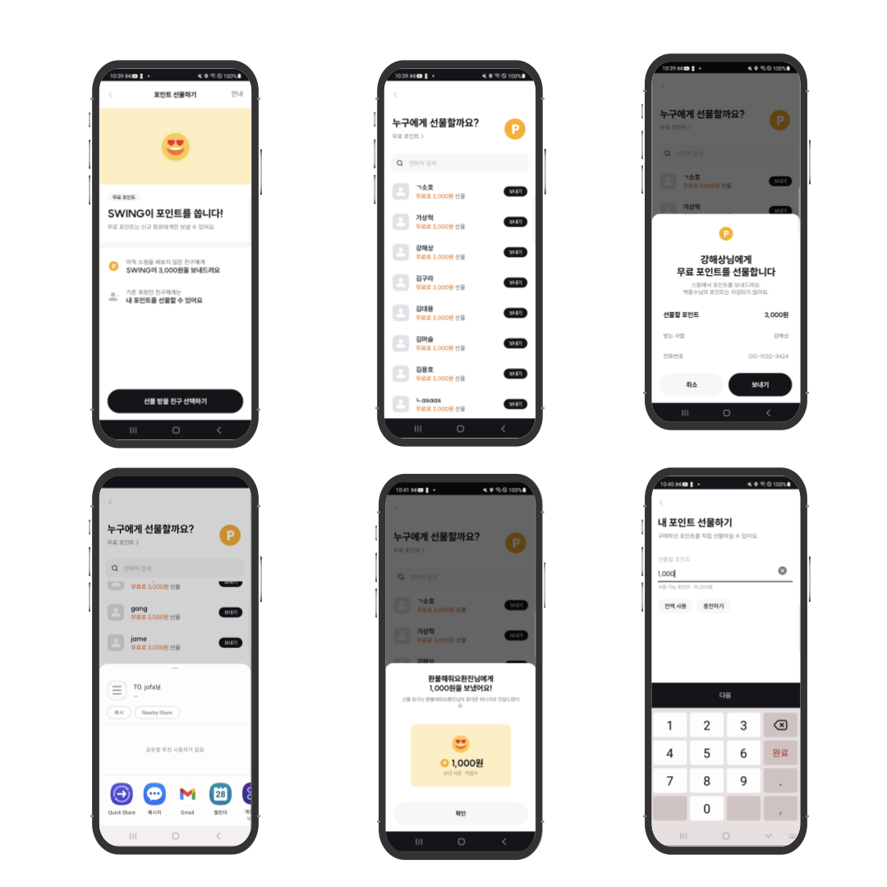
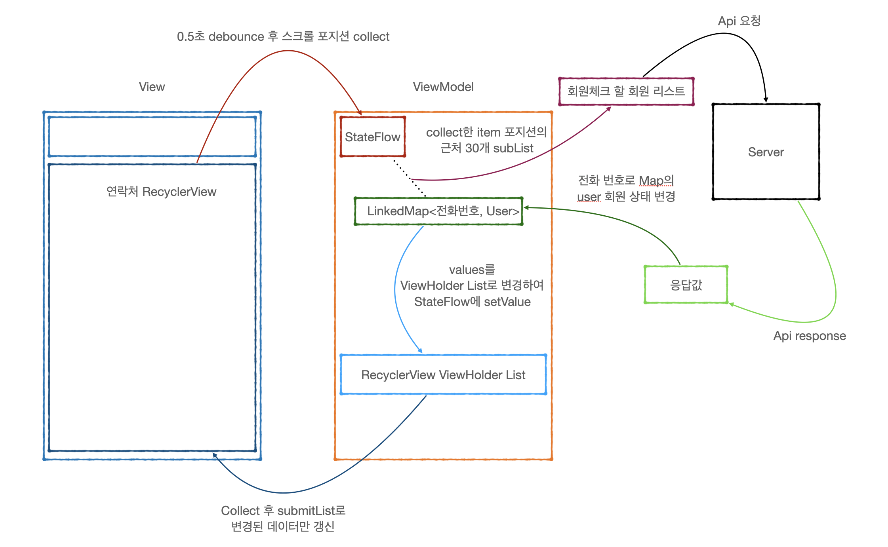
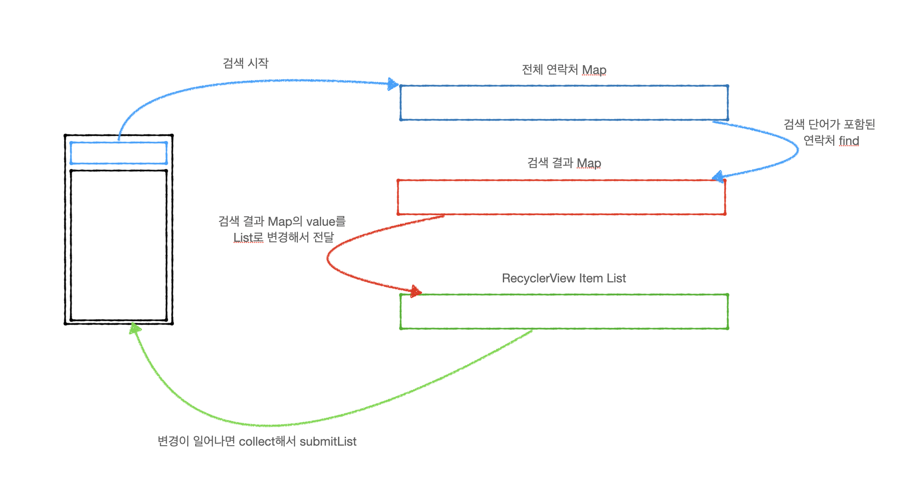

# SWING 포인트 선물하기

Created: August 8, 2023 → August 30, 2023
Tags: Android, Jetpack, Kotlin

<aside>
💡 클라이언트에서 비지니스 로직을 처리하고, 필요한 데이터들을 조합해야하는 상황이 많아서 데이터를 관리하고, 함수명, 가독성 좋은 코드에 대한 고민을 많이 해볼 수 있었고, 기획에 참여하여 여러가지 케이스와 서버에 부하를 줄이는 고민등을 해볼 수 있었던 프로젝트였습니다.

</aside>

### 프로젝트 설명

- 유저의 연락처에 저장된 사람들에게 포인트를 선물하는 기능
- 비회원인 사람들에게 무료 포인트 선물
- 회원인 사람들에게 자신의 포인트를 선물

### 사용기술

- Language: `Kotlin`
- OS: `Android`
- Library: `Jetpack`, `Hilt`, `okHttp3`, `retrofit2`

---

### 주요업무

- SWING Android 앱 포인트 선물하기 기능 개발
- 안드로이드 1 백엔드 1
    
    

---

### 상세 업무

1. 스크롤 위치에 맞춰 회원/비회원 체크 기능
    - `StateFlow`, `RecyclerView`, `AAC viewModel` 사용
        - View부터 시계 방향으로 보시면 됩니다
    
    
    
    - 상세 설명
        - 유저마다 전화번호의 개수를 예상할 수 없어 모든 연락처를 한번에 api 요청을 보내는 것은 무리라고 판단
        - StateFlow에 RecyclerView.OnScrollListener를 이용하여 마지막 item의 Position을 저장
        - debounce를 통해서 0.5초 이상 item의 Position이 똑같거나 변화가 없으면 collect
        - (item의 Position - 20) ~ (item의 Position + 10) 까지의 아이템을 List로 묶어 Api 요청
            - isMember에 Enum을 사용해서 isLoading 상태인 아이템만 List에 추가
                - 이미 회원 체크가 된 연락처는 다시 체크하지 안해서 서버의 부하를 줄임
        - 전화번호를 키값으로하여 응답이오면 LinkedMap에서 바로 해당 번호의 상태를 변경
            

                
LinkedMap 사용 이유

                
    

                - Map을 사용한 이유
                
                    - List로 보관하면 응답으로 온 데이터들을 찾기 위해서 전체 순회를 해야함
                    - Map을 이용해서 전화번호를 키값으로 응답으로 온 데이터만 바로 변경
                
                - 왜 LinkedMap?
                
                    - 한글 → 영어 → 이외 순으로 정렬을 해야하는 요구 사항
                    - HashMap이나 그냥 Map은 들어가는 순서가 보장되지 않음
                    - 이미 정렬을 다해서 오는 데이터를 다시 정렬하지 않기 위해 메모리는 더 사용하더라도 put의 순서가 보장되는 LinkedMap 사용

 
            
            
2. 이름으로 연락처 검색 기능
    - `dataBinding`, `StateFlow`, `AAC viewModel` 사용
    
    
    
    - 상세 설명
        - 양방향 데이터 바인딩을 이용해서 검색창에 입력된 String을 `viewModel`에 `StateFlow`로 전달
        - 0.5초 debounce 후 collect → constains를 활용해서 연락처 이름과 같은 데이터 찾기
        - 찾은 데이터들은 searchResultMap이라는 변수에 저장
        - `RecyclerView`에 searchResultMap를 ViewHolder List로 변환해서 `submitList`
        - 새로 고침이나 `fragment`가 `onStart`를 다시 할 때 searchResultMap의 값으로 전체 연락처 목록을 보여줄지 검색 결과를 보여줄지를 판단