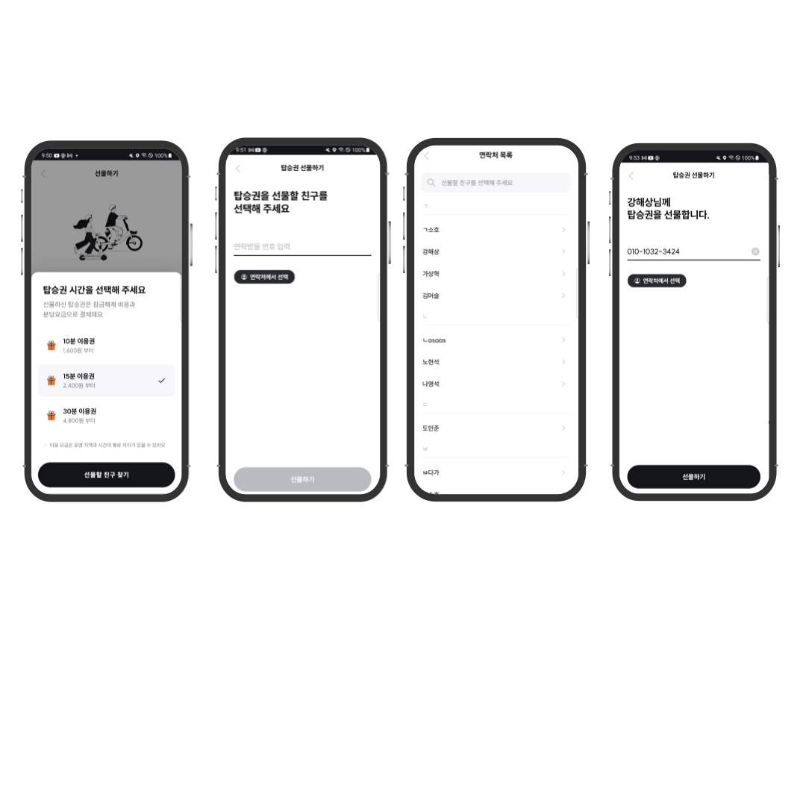

# SWING 라이드 선물하기 기능 개발

Created: June 5, 2023 → July 4, 2023
Tags: Android, Jetpack, Kotlin

<aside>
💡 연락처를 불러오고 가져온 데이터를 가공하면서 여러가지 예외사항을 예측, 처리하며 미리 수도 코드를 작성해보고 설계한 뒤 개발을 하는 것에 대해서 많이 배울 수 있었던 프로젝트였습니다.

</aside>

### 프로젝트 설명

- 신규 유저 유입과 비회원 유저들의 이용을 위한 탑승권 선물하기를 개발
- 회원인 유저가 탑승권을 비회원인 유저에게 선물
- 문자로 온 링크에 접속하여 QR을 찍고 킥보드 이용

### 사용기술

- Language: `Kotlin`
- OS: `Android`
- Library: `WebView`, `Contacts Provider`, `RecyclerView`

---

### 주요업무

- 탑승권 선물하기 기능 설계/개발
- 안드로이드 1, 백엔드 1, 프론트 1, ios 1명
    
    

---

### 상세 업무

1. 저장된 연락처에서 선택하기 기능
    - ContactProvider를 이용하여 저장된 모든 연락처를 불러오기
    - 불러온 이름이 한글이면 초성을, 영어는 맨 앞글자 이외는 &를 key로 map에 전화번호를 저장
        - 한글 → 초성 + 이름으로 정렬
        - 영어 → 소문자로 변경 후 이름으로 정렬
        - else → 이름으로  정렬
        - 정렬된 각 리스트들을 한글 + 영어 + other 순으로 결합 후 넘겨줌
    - 뷰홀더에 데이터들을 넣은 리스트를 만들어서 화면 업데이트
    
2. 문자로 선물하기 기능 
    - inputFilter를 통해 전화번호 입력 구현
    - 양방향 데이터 바인딩으로 input값 collect
    - 입력 값을 체크해서 입력이 끝났으면 맨뒤의 네자리 번호를 뷰 상단에 표시
    
3. 연락처 검색 기능 구현
    - 양방향 데이터 바인딩으로 MutableStateFlow를 edittext에 바인딩
    - input값을 viewModel에서 debounce를 사용 후 0.8초간 변경이 없으면 collect
    - collect된 String이 isEmpty면 원래 연락처 데이터를 보여줌
    - collect된 String이 isNotEmpty면 String이 이름에 포함되는 연락처를 리스트에서 찾아 새로운 리스트 생성
    - 검색 결과 리스트의 데이터를 뷰홀더 리스트로 변경하여 submitList
    - 데이터를 갱신
    
4. 연락처 접근 권한 구현
    - `RequestPermission` 과 `checkSelfPermission` , `shouldShowRequestPermissionRationale` 를 이용하여 `READ_CONTACTS` 권한을 획득
    - 두 번 이상 거부시 권한 설정화면으로 이동