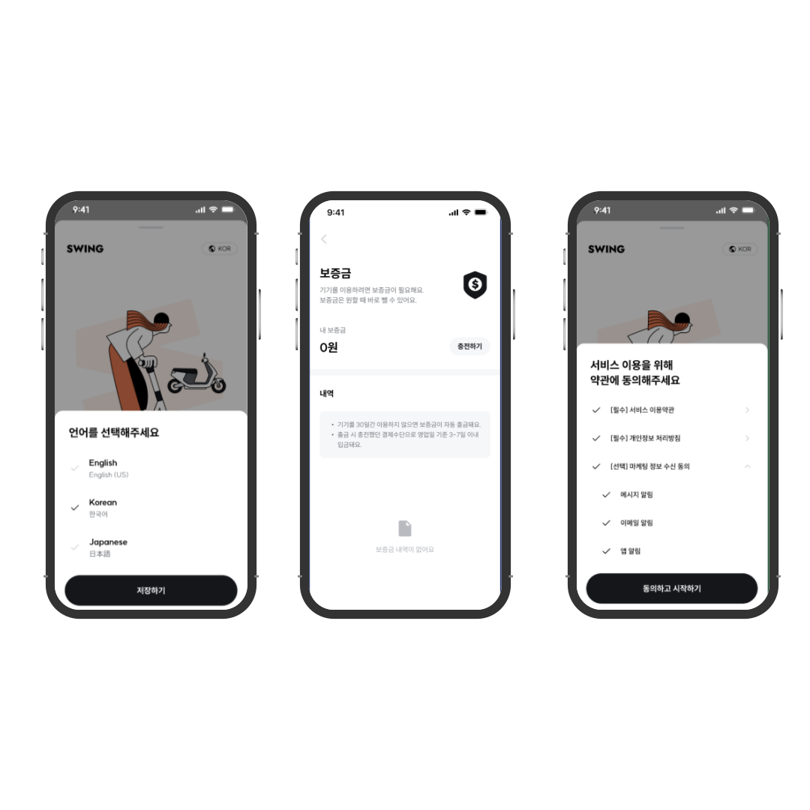

# SWING 외국인 유저를 위한 기능 추가

Created: March 17, 2023 → June 9, 2023
Tags: Android, Jetpack, Kotlin

<aside>
💡 본 프로젝트 에서는 앱의 글로벌화에 대해서 고민해 볼 수 있었고, 리소스 관리와 협업시 git을 사용하면 일어나는 문제들을 고민해보고 브랜치 전략과 충돌 방지에 대해서 고민해 볼 수 있었습니다.

</aside>

### 프로젝트 설명

- 일본 앱과 한국 앱 통합
- 영어 지원 기능
- 외국인 회원가입, 로그인 지원
- 외국인 유저 이용을 위한 보증금 기능 제공

### 사용기술

- Language: 사용 언어
- OS: Android
- Library: 주요 라이브러리

---

### 주요업무

- 보증금 기능 구현
- 다국어 지원 기능 구현
- 로그인/회원가입을 위한 바텀시트
    
    

---

### 상세 업무

1. `LocaleManagerCompat` 와 `AppCompatDelegate` 를 이용한 언어 변경 기능 구현
    - `LocaleManagerCompat`을 이용하여 처음에는 시스템 언어를 이후에는 앱의 언어를 불러옴
        - 시스템 언어가 한국어가 아니면 en을 리턴하여 영어로 설정
    - 유저가 앱의 언어를 변경하면 `AppCompatDelegate`를 이용하여 앱의 언어 변경
        - 번역 리소스 추가
    
2. 회원 가입 약관 바텀 시트 구현
    - 약관은 외부적인 사항이나 내부 정책 변경등으로 언제든지 변경될 수 있기 때문에 앱 배포없이도 변경가능하도록 구현되어야했음
    - `RecyclerView`를 이용하여 View Type을 두개를 만들어 서버에서 내려준 데이터에 따라서 ViewHolder를 추가
    - 서브 약관이 더 있는 type은 `viewHolder` 안에 중첩으로 `RecyclerView`를 사용
    - `animate`을 이용하여 열리고 접히는 동작 구현
    - 모두 체크하기, 상위항목 자동 체크 기능 구현
        - `StateFlow`와 `combine`을 이용해서 필수 항목과 선택 항목 체크 상태를 파악
        - 하위 항목 체크 상태에 따라서 상위 항목의 체크 상태 변경 기능 구현
    
3. 보증금 충전, 결제 화면 구현
    - `RecyclerView`를 이용한 스크롤 뷰 구현
        - `sealed class`와 `data class`를 이용하여 view type에 맞춰 뷰를 그리도록 구현
        - 전체가 하나의 `RecyclerView`로 하단 보증금 내역 부분까지 자연스러운 스크롤 구현
        - 서버에서 내려주는 type과 image를 이용하여 출금, 입금, 환급 내역 동적으로 표시