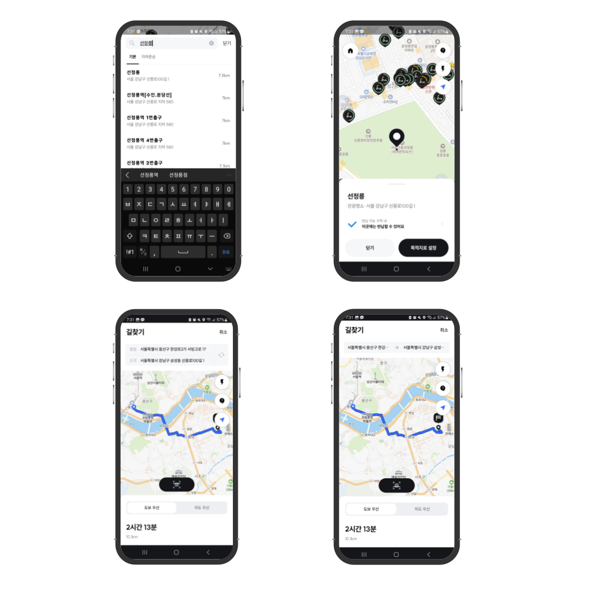

# SWING 길찾기 기능 개발

Created: April 10, 2023 → June 9, 2023
Tags: Android, Jetpack, Kotlin

<aside>
💡 처음으로 메인 신규 피쳐에서 메인 기능을 맡아 작업했던 프로젝트로 백엔드 개발자와 함께 소통하며, 문서화와 소통에 대해 생각해볼 수 있는 시간이었고, 라이프 사이클에 대한 이해와 화면 갱신에 대해서 직접 겪어볼 수 있었던 시간이었습니다.

</aside>

### 프로젝트 설명

- 킥보드를 타고 목적지까지 갈 수 있는 경로를 보여주는 기능 제공
- 유저의 현재 위치와 목적지의 위치를 보여주는 기능 제공
- 도보와 차도 두가지의 경로를 제공
- 도보와 차로 이동시 걸리는 시간 제공

### 사용기술

- Language: `Kotlin`
- OS: `Android`
- Library: `Jetpack`, `Retroifit2`, `okhttp3`

---

### 주요업무

- SWING Android 앱 길찾기 기능 개발
- 안드로이드 1 백엔드 1
    
    

---

### 상세 업무

1. 자동 장소 검색 기능
    - 양방향 데이터 바인딩과 `StateFlow`를 이용해서 실시간 api 요청 구현
        - `debounce`를 이용해서 0.8초동안 입력이 없으면 해당 검색어로 Api 요청
    - 응답을 받으면 `RecyclerView`에 `submitList`
    
2. 커스텀 탭 구현
    - `RecyclerView`와 `StateFlow`를 이용해서 탭 구현
    - 가로로된 `RecyclerView`에 `ViewHolder`로 탭들을 넣음
    - 터치가 일어나면 tabState(Enum)을 가지고 있는 `StateFlow`의 값을 변경
    - TabState가 변경되면 변경된 Enum 값에 따라 해당 `ViewHoldel`의 뷰 상태를 변경
    - `tabLayout`을 직접 구현한 이유
        - 탭부분만 다른 화면이 2개 존재
            - 도착/출발지 검색화면과 경로 검색 화면이 상단 탭 부분만 다르고 같은 Layout이 었음
            - Search관련된 화면을 `abstract class`로 만들어 상단 탭 부분만 직접 구현하면 똑같은 레이아웃을 2번 만들지 않아도 됨
        - 동적인 탭 구현이 필요
            - 검색 상태에 따라서 탭이 변경되어야하는 요구사항
                - 검색 중이아니면 → 최근 검색어
                - 검색 중 → 기본, 가까운순
            - `RecyclerView`를 이용해서 구현하면 탭을 동적으로 구현가능
    
3. 가까운 거리 순으로 검색 결과 정렬 기능
    - 응답으로 온 결과들을 *`sortedWith`* 와  ***`nullsLast`* 를 이용해서 **거리순으로 정렬하여 List에 보관
        - 거리가 null이 올 수도 있어서 null은 마지막으로 보냄
    - 유저가 선택한 탭에 따라서 RecyclerView의 List 변경
    
4. 최근 검색 기록 기능
    - `Room`을 이용하여 검색한 검색어의 저장, 삭제 구현
    - 처음 화면에 진입하면 `Room` 에 저장된 데이터를 전부 읽어옴
        - `StateFlow`를 이용하여 데이터 보관 및 화면 갱신
    - 장소를 검색하고, 선택하면 선택한 Item을 `Room`에 저장하고 다음 화면으로 이동
    - 최근 검색어를 삭제하면 `Room`에서 데이터 삭제
    - 저장시 최대 10개가 넘으면 오래된 데이터를 삭제하고, 새로운 데이터를 저장
    
5. 전제를 덮는 Dialog로 검색화면 구현
    - `Fragment`를 이용시 뒤로가거나 다음 동작을 진행할때 지도를 다시 그리는 현상 발생
    - 화면 전체를 덮는 Dialog로 화면을 구현하여 다시 지도가 초기화되는 현상 수정
    
6. 경로 표시기능
    - NaverMap api의 overlay를 이용하여 경로를 지도에 표시
        - 도착지와 출발지를 이용 서버에서 경로 좌표를 받아옴
        - 응답으로 온 좌표들을 List에 넣고 overlay 구현