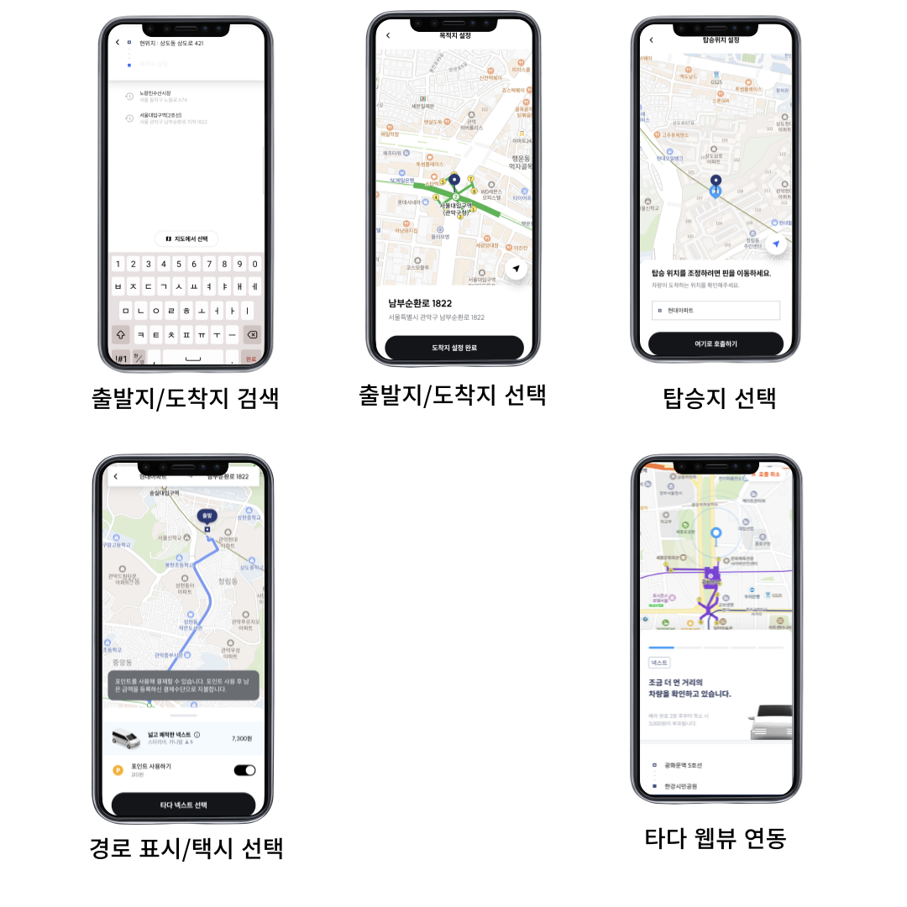

# SWING TADA 택시 연동 프로젝트

time: 2023-07-10 → 2023-08-07 
Tags: Android, Jetpack, Kotlin

<aside>
💡 본 프로젝트에서는 혼자 택시 호출부터 웹뷰를 이용한 결제 완료 이후의 로직까지 설계, 개발을 진행하면서 상태 관리, 백스택 관리의 중요성과 lottie를 다루는 방법, 웹뷰와의 브릿지 통신까지 여러 방면으로 배울 수 있는 프로젝트였습니다.

</aside>

### 프로젝트 설명

- SWING 앱에서 타다 택시 호출 기능 제공
- 탑승부터 결제까지 제공
- 출발지, 탑승지, 목적지 설정 기능 제공

### 사용기술

- Language: `Kotlin`
- OS: `Android`
- Library: `retrofit2`, `okhttp3`, `jetpack`, `AAC ViewModel`, `MVI`, `Flow`, `Coroutine`, `Kotlin`, `xml`, `lottie`, `navigation` `component`

---

### 주요업무

- SWING 안드로이드 앱에서 타다 택시 호출, 결제까지 모든 기능 구현
- 안드로이드 1명 IOS 2명 풀스택 1명이 함께 진행

---

### 상세 업무

1. 출발지/목적지 검색 기능 구현
    - 양방향 데이터 바인딩을 이용하여 `viewModel`에 있는 `StateFlow`를 연결
    - `Stateflow`에 `debounce`를 걸고 일정 시간동안 입력이 없으면 collect
    - `collect`된 값을 api에 전송
    - list로 내려온 Response를 `List<viewHolder>`로 변경
    - `viewHolder` list를 `submitList`하여 변경된 값만 화면에서 갱신
    - input 값을 지우면 최근 검색 기록을 submitList하여 화면 갱신
    
2. 출발지/목적지 핀으로 설정 기능
    - 지도 스크롤시 lottie Animation을 pause (떠있는 상태로 유지)
    - 지도를 멈추면 lottie를 다시 재생
    - 지도의 정중앙의 좌표를 api로 전송
    - 응답으로 내려온 지도 정중앙의 주소를 `StateFlow`에 전달
    - `StateFlow`를 `collect`하여 하단의 텍스트 변경
    - 다음 화면 진입시 백스택에서 해당화면을 pop
    
3. 경로 안내 기능
    - 출발지부터 목적지까지의 경로를 저장하고 api에 전송
    - 출발지/도착지에 마커 표시
    - 응답으로 온 죄표 list를 이어 overlay로 경로 표시
    - `BottomSheetBehavior` 와  `CoordinatorLayout` 을 이용하여 하단뷰의 상단만 크기 변경이 가능하도록 구현
        - 택시 종류를 보여주기 위함
    - `RecyclerView` 를 이용한 동적인 뷰 구현
        - 응답으로 내려준 데이터의 리스트만큼 뷰홀더를 생성해서 갱신
    - `xml`과 `StatFlow`를 이용한 포인트 설명 스낵바 구현
    - `WindowInsetsControllerCompat`을 이용하여 systemUi 컨트롤
    
4. 탑승지 선택 기능
    - Naver Map 정중앙의 좌표(주소)에서 탑승 가능 지역까지 거리 점선으로 표시
        - Naver map의 **PolylineOverlay**를 활용해서 점선 표시 구현
    - 탑승지역의 주소 표시
    
5. 웹뷰 연동
    - 현재 기기의 좌표가 변경될때마다 브릿지로 좌표 전달
    - 브릿지로 close를 요청하면 화면 popUp
    - *`onBackPressedDispatcher`* 를 이용하여 뒤로가기 막기
    - 앱을 껐다가 켰을 경우 첫 Fragment의 onResume에서 api를 통해 택시 탑승 여부를 확인 후 다시 타다 웹뷰를 호출
    - 결제까지 완료되면 타다 웹뷰 종료 후 스윙 웹뷰를 통해 포인트 적립 등 혜택 안내